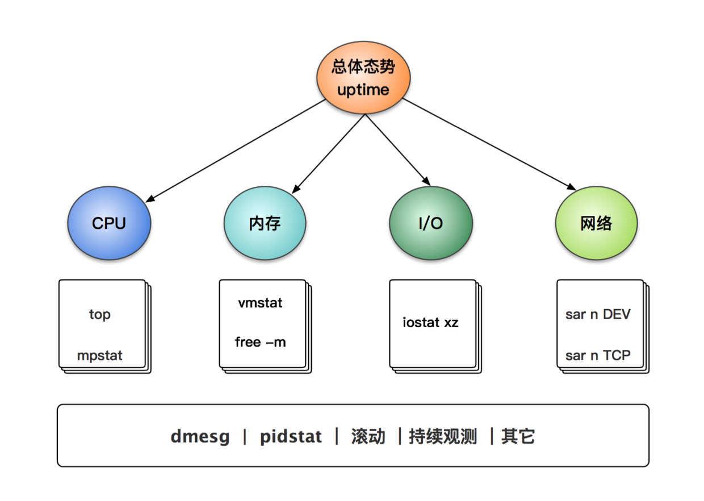

<!--
 * @Date: 2020-04-18 21:04:40
 * @LastEditors: lizhiyuan
 * @LastEditTime: 2020-04-26 12:54:34
 * @FilePath: /慢路径优化策略/README.md
 -->

# 慢路径优化策略

页面加载时间 + 网络往返时间 + 服务器运行代码 + 数据库查询 = 完整访问的时间

## 1. 页面加载阶段是否有问题

通常我们会遇到很多慢的情况,浏览器慢,网络慢,服务器慢,数据库慢,我们来分析下一个请求的整个过程

一般的web请求都是借助于浏览器(输入url回车)或者代码Ajax实现的,无论怎么说,都是由浏览器给我们将请求发出去

请求的起点在浏览器,终点也在浏览器...


- Queuing 请求等待队列的时间
- Stalled 请求停转的时间
- If applicable: DNS lookup, initial connection, SSL handshake  DNS解析时间/TCP三次握手/SSL握手阶段
- Request sent 发送我们的请求所耗费的时间,通常这个时间是比较短的
- Waiting (Time to first byte (TTFB)) 请求 ----> 服务器 ----> 客户端接收到第一个字节的时间
- Content Download 响应数据下载的时间

**什么情况下请求会排队**

1. 由于该请求的优先级比关键资源(例如脚本/样式)低,因此被渲染引擎推迟了,这通常发生在图片上（可忽略）
2. 该请求被搁置以等待即将释放的不可用的TCP套接字(可忽略)
3. 由于浏览器在HTTP1上每个源仅仅允许6个TCP连接,因此该请求被暂停,如果我们的请求请求的同一个服务器上的资源比较多的话，chrome会自动的为它开辟6个TCP的连接,可观察是否有DNS和SSL握手的时间，如果有证明是一个新的TCP连接。。。。如果超出了6个连接的话,剩余的连接会排队,就是queuing请求等待队列的时间
4. 花费在制作磁盘缓存条目上的时间(通常非常快)

前端解决方案:

- 既然它对每个域有这种限制,我们可以在前端使用CDN,用多个子域名的方式提供服务,例如图片服务器、css服务器、JS服务器,将资源拆到多个子域中均匀分配
- 减少请求的次数,尽量的在一次请求中完成
- 加缓存,利用浏览器的缓存,减少与服务器的交互次数
- 图片的压缩、图片的懒加载、图片的预加载,主动减少一些不必要的加载


## 2. 客户端 《======》 服务器 网络往返是否有问题

### 网络通不通

客户那边发送请求到服务器的时间以及服务器到客户端的时间,最简单的方式就是使用系统shell的命令ping 服务器Ip地址来得到,如果这个速度比较慢的话,那么就证明客户端到服务器的链路上存在着问题,这个问题在本地测试是不存在网络问题的,例如我们本地部署的测试服务器,打开是用localhost:3000打开的,理论上来讲,就自动忽略了网络问题

客户端上行的速度可以在客户端组织一定数量的数据包发给服务器,看服务器的接受速度,服务器可简单的接受后立即返回

服务器的下行速度可以在服务器组织一定数量的数据包发给客户端,看客户端的接受速度,客户端可简单的接受后计算时间

整体的时间都可以放在客户端完成计时操作......

ping -----> 127.0.0.1 看自己本地的TCP协议是否有问题

ping ----> 内网地址 检查本地的IP地址设置是否有误

ping ----> 网关 查看自己和路由器之间的连接是否存在问题

ping ----> 远程服务器地址 看整体的链路是否存在问题....

***ping不的话,直接用mtr来看具体那里有丢包***

假设出现比较慢的情况,我们就需要用到mtr来查看到底是在哪个环节慢了..

    $ sudo mtr  -r (以报告的形式) www.baidu.com 

    HOST: lizhiyuandeMacBook-Pro.loca Loss%   Snt   Last   Avg  Best  Wrst StDev
    1.|-- 192.168.0.1                0.0%    10    1.6   2.3   1.5   8.5   2.2
    2.|-- 192.168.1.1                0.0%    10    1.9   2.2   1.9   3.2   0.5
    3.|-- 116.233.16.1               0.0%    10    5.0  14.7   4.9  57.2  17.4
    4.|-- 61.152.6.85                0.0%    10    4.7   9.6   4.6  28.6   8.6
    5.|-- ???                       100.0    10    0.0   0.0   0.0   0.0   0.0
    6.|-- ???                       100.0    10    0.0   0.0   0.0   0.0   0.0
    7.|-- 180.163.38.30              0.0%    10   13.0   7.2   5.5  13.0   2.9
    8.|-- 116.251.113.218            0.0%    10    5.7   7.3   5.4  19.7   4.4
    9.|-- 42.120.239.173             0.0%    10   11.5  11.5  11.0  12.0   0.3
    10.|-- ???                       100.0    10    0.0   0.0   0.0   0.0   0.0
    11.|-- ???                       100.0    10    0.0   0.0   0.0   0.0   0.0
    12.|-- ???                       100.0    10    0.0   0.0   0.0   0.0   0.0
    13.|-- 47.98.111.171              0.0%    10   10.9  11.4  10.9  13.5   0.8

> 一般首先看最后一跳，如果最后一跳有丢包，那么这个分析才是有意义的。因此判断是否丢包，丢在哪里，看最后几跳是最明显的。不要因报告的100％损失而感到震惊。这并不表示有问题。你可以看到后续的跳数没有损失

ping看到的参数主要是网络的直连情况,如果具体到我们的应用程序的话,我们还要观察端口的连接情况,这部分放在ping通的基础上

### 应用通不通

1. 本地端口的状态

我们在本地 端口 ----> 进程  

        #Liunx
        netstat -nap | grep 端口号

        #mac
        isof -i:端口号 该端口号对应的进程ID

进程 ----> 端口

        #Liunx
        ps -ef | grep 进程
        netstat -nap | grep 进程
        
        #mac
        lsof -p 94580|grep TCP 该进程打开的TCP连接

进程 -----> 开辟的线程

        #Liunx
        pstree -p  进程号
        
        #mac
        #看到的信息有限
        ps -M 进程号


2. 查看本机所有开放的端口情况

        #Mac下
        lsof -nP -iTCP -sTCP:LISTEN 查看打开的TCP连接端口

        #简单点的
        lsof -i TCP 查看所有的TCP连接
        
        #Linux
        netstat -pt


3. 远程端口的状态

        #查看远程端口的开启状态,嗅探端口
        nmap IP地址
        
        #来测试对应的端口是否正常，端口是否开启,开启后返回的内容,根据这个来判断这个端口的作用....
        curl -v IP地址:端口

        #与 www.baidu.com 的 80 端口建立一个 TCP 连接(本地端口随机)
        nc www.baidu.com 80  

        #使用本地 1234 端口与 www.baidu.com 的 80 端口建立一个 TCP 连接:
        nc -p 1234 www.baidu.com 80

        #与 host.example.com 的 53 端口建立一个 UDP 连接:
        nc -u host.example.com 53

        


## 3. 服务器

### 1.代码时间统计 --- 找到耗时较长函数的常规办法


浏览器的TTFB的时间 = 网络往返的时间（本地测试忽略） + 服务器处理时间

但是如果是在忽略网速的情况下,TTFB = 服务器的处理时间

- 首先用curl来测试直接发送Http请求的时间 （服务器的整体处理时间）

         curl -w %{time_connect}:%{time_starttransfer}:%{time_total} -s -o /dev/null -b "connect.sid=s%3A6YJPXTO0vwP7211FAsRkH3pUtR_v_Uyu.8ynQhN8zkLSp4vNlZoYnAjI0VT4bYI3RwNyrFbnEDJQ" localhost:3000/admin/masterdata/people/people_list4m


- 然后用shell来测试远程数据库的查询时间 (数据库查询的时间)

        mongo mongodb://mongo.test.sec.zhisiyun.com:29999
        //需要注意的是无论是用工具查，还是用shell查，他都不会一次性给你返回所有的结果,都是分批次查的

- 涉及大量异步函数的代码,需要在异步函数结束后的回调函数中检测运行的时间,细分后,找到比较慢的那个函数

        console.time("第一个异步任务");
        async.waterfall([function(cb){
                console.timeEnd("第一个异步任务");
                console.time("第二个异步任务");
                cb()
        },function(cb){
                console.timeEnd("第二个异步任务");
                cb()
        }],function(err,result){

        })


### 2. Liunx系统优化 --- 黄金60秒

运行下面10个命令，你可以在60秒内，获的系统资源利用率和进程运行情况的整体概念。查看是否存在异常、评估饱和度

1. uptime
2. dmesg | tail vmstat 1
3. mpstat -p ALL 1 pidstat 1
4. iostat -xz 1 free -m 
5. sar -n DEV 1
6. sar -n TCP,ETCP 1 top




这些命令需要安装sysstat包。这些命令输出的指标，将帮助你掌握一些有效的方法:一整套寻找性能瓶颈的方法论。这些命令需要检查所有资源的利用率、饱和度和错误信息(CPU/内存/磁盘)。同时,当你检查或排除一些资源的时候，需要注意在检查的过程中，根据指标数据指引，逐步缩小目标范围

***1. uptime***
```
$ uptime
23:51:26up21:31, 1user, loadaverage:30.02,26.43,19.02
```
这是一个快速查看平均负载的方法，表示等待运行的进程的数量.在liunx系统中，这些数字包含等待cpu运行的进程数以及不间断IO阻塞的进程数。它展示了一个资源负载的整体概念。

***2. vmstat 1***
```
procs -----------memory---------- ---swap-- -----io---- --system-- -----cpu-----
r  b   swpd   free   buff  cache   si   so    bi    bo   in   cs us sy id wa st
6  0      0 27900472 204216 28188356    0    0     0     9    1    2 11 14 75  0  0
9  0      0 27900380 204228 28188360    0    0     0    13 33312 126221 22 20 58  0  0
2  0      0 27900340 204240 28188364    0    0     0    10 32755 125566 22 20 58  0  0
```

字段说明

proces(进程)
- r 运行队列中的进程数量
- b 等待IO的进程数量

memory(内存)
- swpd 使用虚拟内存的大小
- free 可用内存的大小
- buff 用作缓冲的内存大小
- cache 用作缓冲的内存大小

swap
- si 每秒从交换区写到内存的大小
- so 每秒写入交换区的内存大小

io(块大小是1024字节)
- bi 每秒读取的块数
- bo 每秒写入的块数

system
- in 每秒中断数，包括时钟中断 (CPU瓶颈)
- cs 每秒的上下文切换数 (CPU瓶颈)

cpu(以百分比表示)
- us 用户进程的执行时间 (CPU瓶颈)
- sy 系统进程的执行时间 (CPU瓶颈)
- id 空闲时间(CPU瓶颈)
- wa 等待IO时间(IO瓶颈)


***3. mpstat P ALL 1***
```
$ mpstat -P ALL 1
Linux 3.13.0-49-generic (titanclusters-xxxxx) 07/14/2015 _x86_64_ (32 CPU)
07:38:49 PM CPU %usr %nice %sys %iowait %irq %soft %steal %guest %gnice %idle
07:38:50 PM all 98.47 0.00 0.75 0.00 0.00 0.00 0.00 0.00 0.00 0.78
07:38:50 PM 0 96.04 0.00 2.97 0.00 0.00 0.00 0.00 0.00 0.00 0.99
07:38:50 PM 1 97.00 0.00 1.00 0.00 0.00 0.00 0.00 0.00 0.00 2.00
07:38:50 PM 2 98.00 0.00 1.00 0.00 0.00 0.00 0.00 0.00 0.00 1.00
07:38:50 PM 3 96.97 0.00 0.00 0.00 0.00 0.00 0.00 0.00 0.00 3.03
[...]
```

这个命令可以按照时间线打印每个CPU的消耗，常常用于检查不均衡的问题。如果只有一个繁忙的CPU,可以判断是属于单进程。但是，大部分的网络应用都是多进程模式的，所以，几乎可以说，这个命令的唯一意义是检查比较简单的问题

反正我的建议就是如果能使用top命令就使用top命令先分析出大致系统的问题是CPU还是内存还是IO....可以使用`1`查看各个CPU的情况,可以使用P查看CPU使用率最高的进程,或者使用M查看内存最高的进程,


***4. pidstat 1***

当确定CPU很高的时候,可以使用这个命令查看

```
# 每隔1秒输出1组数据（需要 Ctrl+C 才结束）
# -w参数表示输出进程切换指标，而-u参数则表示输出CPU使用指标, -t则表示查看线程的切换指标
$ pidstat -w -u 1
08:06:33      UID       PID    %usr %system  %guest   %wait    %CPU   CPU  Command
08:06:34        0     10488   30.00  100.00    0.00    0.00  100.00     0  sysbench
08:06:34        0     26326    0.00    1.00    0.00    0.00    1.00     0  kworker/u4:2

08:06:33      UID       PID   cswch/s nvcswch/s  Command
08:06:34        0         8     11.00      0.00  rcu_sched
08:06:34        0        16      1.00      0.00  ksoftirqd/1
08:06:34        0       471      1.00      0.00  hv_balloon
08:06:34        0      1230      1.00      0.00  iscsid
08:06:34        0      4089      1.00      0.00  kworker/1:5
08:06:34        0      4333      1.00      0.00  kworker/0:3
08:06:34        0     10499      1.00    224.00  pidstat
08:06:34        0     26326    236.00      0.00  kworker/u4:2
08:06:34     1000     26784    223.00      0.00  sshd
```

cswch:自愿上下文切换，是指进程无法获取所需的资源，导致的上下文切换。比如说IO/内存等系统资源不足的时候，会发生自愿上下文切换

nvcswch:非自愿上下文切换，则是指进程由于时间片已到等原因，被系统强制调度，进而发生的上下文切换。例如说，大量的进程争抢CPU,就容易发生非自愿切换

总结:进程与进程调度的时候会产生上下文切换（属于正常的进程时间轮片）/进程涉及IO操作的时候会产生上下文切换（包括了系统调用、中断等操作产生的上下文切换）/线程与线程之间产生上下文切换

- 用户CPU比较高的话，说明用户态进程占用了较多的CPU，所以应该着重排查进程的性能问题

- 系统的CPU比较高的话，说明内核态占用了太多的CPU,所以应该着重排查线程和系统调用的性能问题
- IO较高的时候,暂时可以用top命令中的%wa来查看...等待IO的时间


***5. iostat xz 1 ***

当确定IO很高的时候，可以使用这个命令查看
```
/root$iostat -d -x -k 1 1
Linux 2.6.32-279.el6.x86_64 (colin)   07/16/2014      _x86_64_        (4 CPU)

Device:         rrqm/s   wrqm/s     r/s     w/s    rkB/s    wkB/s avgrq-sz avgqu-sz   await  svctm  %util
sda               0.02     7.25    0.04    1.90     0.74    35.47    37.15     0.04   19.13   5.58   1.09
dm-0              0.00     0.00    0.04    3.05     0.28    12.18     8.07     0.65  209.01   1.11   0.34
dm-1              0.00     0.00    0.02    5.82     0.46    23.26     8.13     0.43   74.33   1.30   0.76
dm-2              0.00     0.00    0.00    0.01     0.00     0.02     8.00     0.00    5.41   3.28   0.00
```

- 如果%iowait的值过高，表示硬盘存在I/O瓶颈。
- 如果 %util 接近 100%，说明产生的I/O请求太多，I/O系统已经满负荷，该磁盘可能存在瓶颈。
- 如果 svctm 比较接近 await，说明 I/O 几乎没有等待时间；
- 如果 await 远大于 svctm，说明I/O 队列太长，io响应太慢，则需要进行必要优化。
- 如果avgqu-sz比较大，也表示有大量io在等待。

***6. free m***

当确定内存很高的时候，可以使用这个命令查看

```
 $ free -m
                total        used        free      shared  buff/cache   available
  Mem:           1504        1491          13           0         855      792
  Swap:          2047           6        2041
```
- free 内存接近 0
- used 内存接近 total
- available 内存（或“空闲+缓冲区/缓存”）有足够的空间（比如说占总数的20％以上）
- swap used 不变


***7. sar***

sar是System Activity Reporter（系统活动情况报告）的缩写。sar工具将对系统当前的状态进行取样，然后通过计算数据和比例来表达系统的当前运行状态。它的特点是可以连续对系统取样，获得大量的取样数据；取样数据和分析的结果都可以存入文件，所需的负载很小。sar是目前Linux上最为全面的系统性能分析工具之一，可以从14个大方面对系统的活动进行报告，包括文件的读写情况、系统调用的使用情况、串口、CPU效率、内存使用状况、进程活动及IPC有关的活动等，使用也是较为复杂。

sar是查看操作系统报告指标的各种工具中，最为普遍和方便的；它有两种用法；

追溯过去的统计数据（默认）
周期性的查看当前数据

要判断系统瓶颈问题，有时需几个 sar 命令选项结合起来；

1. 怀疑CPU存在瓶颈，可用 sar -u 和 sar -q 等来查看
2. 怀疑内存存在瓶颈，可用sar -B、sar -r 和 sar -W 等来查看
3. 怀疑I/O存在瓶颈，可用 sar -b、sar -u 和 sar -d 等来查看


- -A 汇总所有的报告
- -a 报告文件读写使用情况
- -B 报告附加的缓存的使用情况
- -b 报告缓存的使用情况
- -c 报告系统调用的使用情况
- -d 报告磁盘的使用情况
- -g 报告串口的使用情况
- -h 报告关于buffer使用的统计数据
- -m 报告IPC消息队列和信号量的使用情况
- -n 报告命名cache的使用情况
- -p 报告调页活动的使用情况
- -q 报告运行队列和交换队列的平均长度
- -R 报告进程的活动情况
- -r 报告没有使用的内存页面和硬盘块
- -u 报告CPU的利用率
- -v 报告进程、i节点、文件和锁表状态
- -w 报告系统交换活动状况
- -y 报告TTY设备活动状况

sar n TCP,ETCP 1 

active/s: 本地初始化的 TCP 连接数 ／每秒（例如，通过connect() ）
passive/s: 远程初始化的 TCP 连接数／每秒（例如，通过accept() ）
retrans/s: TCP重发数／每秒

### 3. 常见疑难杂症分析总结

1. 


